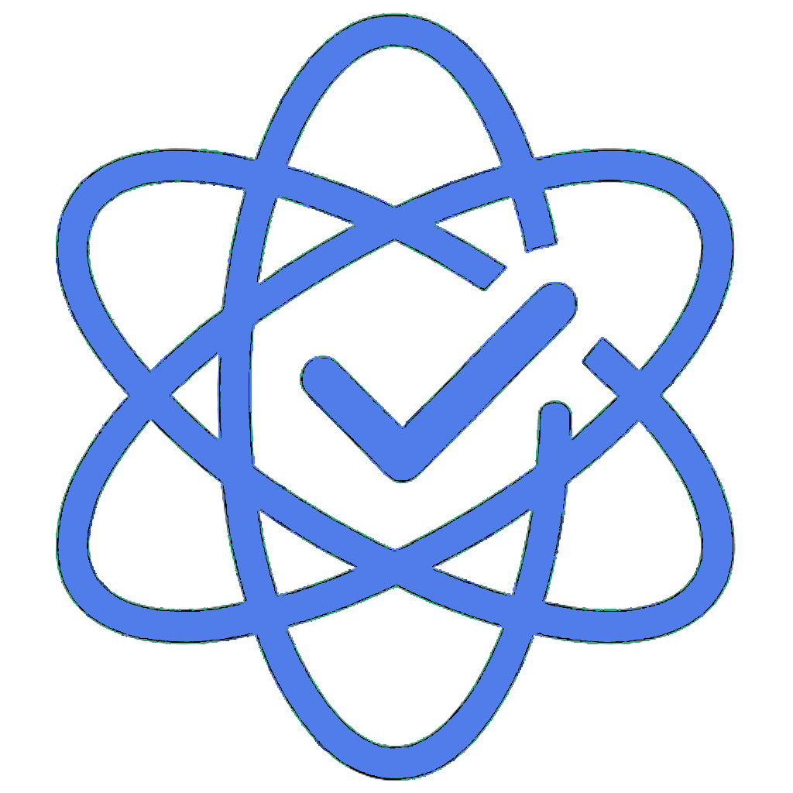

# AtomicWeek - Productivity Tracker

<div align="center">
  
  
  **Daily and weekly focus tracker for enhanced productivity** 📊
</div>

---

## 🚀 Get Started

### Installation

1. **Install dependencies**

   ```bash
   npm install
   ```

2. **Start the development server**

   ```bash
   npx expo start
   ```

3. **Run on device**
   - Scan the QR code with Expo Go app (iOS/Android)
   - Or press `a` for Android emulator, `i` for iOS simulator

---

## 📱 Building for Production

### Android APK Build

1. **Navigate to project root**

   ```bash
   cd /path/to/your/project
   ```

2. **Generate native Android code**

   ```bash
   npx expo prebuild --platform android
   ```

3. **Build optimized APK**

   ```bash
   cd android && export ANDROID_HOME=~/Library/Android/sdk && export JAVA_HOME=/opt/homebrew/opt/openjdk@17/libexec/openjdk.jdk/Contents/Home && ./gradlew assembleRelease
   ```

4. **Find your APK**
   - `android/app/build/outputs/apk/release/app-arm64-v8a-release.apk` (32MB - Modern devices)
   - `android/app/build/outputs/apk/release/app-armeabi-v7a-release.apk` (26MB - Older devices)

---

## 🛠️ Tech Stack

- **React Native** - Cross-platform mobile framework
- **Expo** - Development platform and tools
- **TypeScript** - Type-safe JavaScript
- **Expo Router** - File-based navigation
- **SQLite** - Local database storage

---

## 📄 License

This project is licensed under the MIT License.
